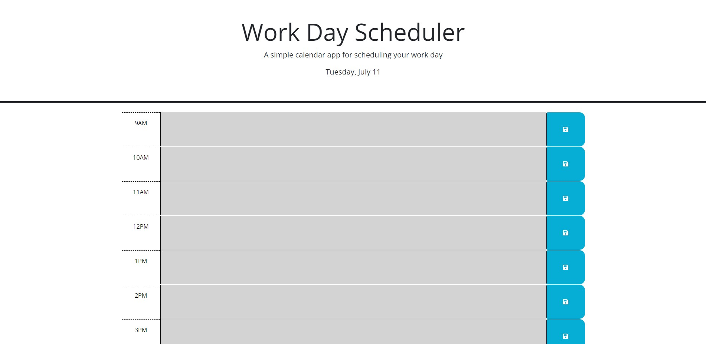

# work-Schedule

## Description

Provide a short description explaining the what, why, and how of your project. Use the following questions as a guide:

- What was your motivation? the motivation to create this appluication was in order too create a work schedule from time of 9am-5pm, in order to schedule work and that is color coded
to insure that you know what time is current and what times have passed as well as showing hopw much time is left
- What problem does it solve? this application solves the need of having to look at time, as well as being able to store information for work locally on your computer rather than having to use
things such as a note pad, the application is also color coded in the sense to make time telling mroe simple so that the user knows what time it is exactly.
- What did you learn? I learned how to use JS and local storage as well as jquery building this application to make the code shorter thus more efficient.

## Link and image
https://lucaswyski001.github.io/coding-quiz/

N/A

## Usage

This prework study guide can be used to study notes and look back at web your web development journey, you can use this applicaiton to study what you have learned and also add topics, think
of this as a note book, where you can add notes and delete notes, and study them, all while without having to whip out a notebook and go page by page(Save the Trees as they say).

## Credits

Mica Villanueva: helped in the development of code debugging and bringing up ideas to the table in order to get the order of the functions

Daniel Lee: helped in the development of code partnering with functions

## License

MIT License

Copyright (c) 2023 Lucas Wysoczanski

Permission is hereby granted, free of charge, to any person obtaining a copy
of this software and associated documentation files (the "Software"), to deal
in the Software without restriction, including without limitation the rights
to use, copy, modify, merge, publish, distribute, sublicense, and/or sell
copies of the Software, and to permit persons to whom the Software is
furnished to do so, subject to the following conditions:

The above copyright notice and this permission notice shall be included in all
copies or substantial portions of the Software.

THE SOFTWARE IS PROVIDED "AS IS", WITHOUT WARRANTY OF ANY KIND, EXPRESS OR
IMPLIED, INCLUDING BUT NOT LIMITED TO THE WARRANTIES OF MERCHANTABILITY,
FITNESS FOR A PARTICULAR PURPOSE AND NONINFRINGEMENT. IN NO EVENT SHALL THE
AUTHORS OR COPYRIGHT HOLDERS BE LIABLE FOR ANY CLAIM, DAMAGES OR OTHER
LIABILITY, WHETHER IN AN ACTION OF CONTRACT, TORT OR OTHERWISE, ARISING FROM,
OUT OF OR IN CONNECTION WITH THE SOFTWARE OR THE USE OR OTHER DEALINGS IN THE
SOFTWARE.

---

## Features

If your project has a lot of features, list them here.

## How to Contribute

If you created an application or package and would like other developers to contribute to it, you can include guidelines for how to do so. The [Contributor Covenant](https://www.contributor-covenant.org/) is an industry standard, but you can always write your own if you'd prefer.

## Tests

Go the extra mile and write tests for your application. Then provide examples on how to run them here.